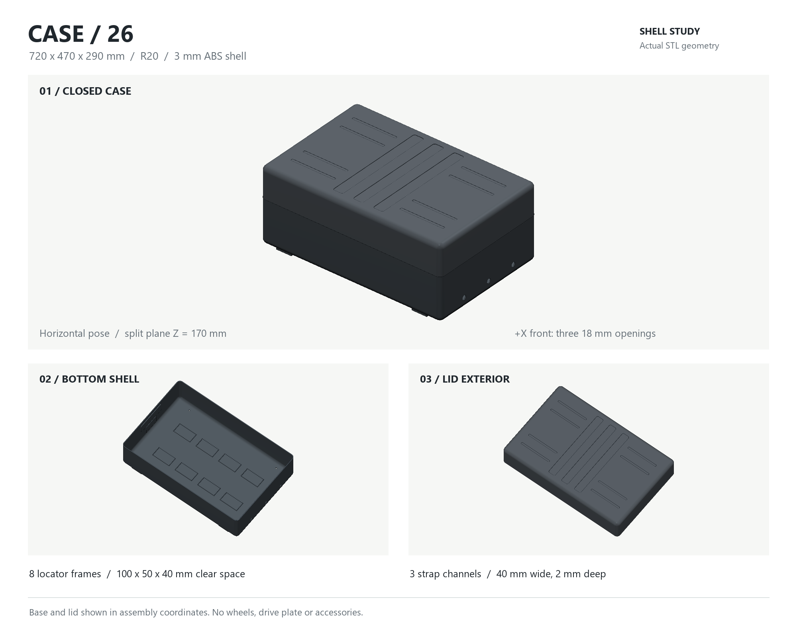

# 移动奶龙 / Mobile Nailong

行李箱躺平 = 配重 + 载重车。立牌 **1.6 m** 绑在箱顶。V1 拆原装轮、整箱扎在成品底盘上，**不考虑打开箱子**。

https://github.com/Dalaoyuan2020/mobile-nailong

## 从这开始

1. [docs/LAYERS.md](docs/LAYERS.md) — 分层
2. [docs/TASKS.md](docs/TASKS.md) — 勾选
3. [docs/CHASSIS.md](docs/CHASSIS.md) — V1 买哪种底盘
4. [docs/PHYSICS.md](docs/PHYSICS.md) — 重心
5. [docs/PROMPT_CASE_FIRST.md](docs/PROMPT_CASE_FIRST.md) — 本地建模箱壳
6. [docs/PROMPT_STAND_HANDLE.md](docs/PROMPT_STAND_HANDLE.md) — 拉杆与 1.6 m 立牌

## 锁定

- 箱：26 寸优先，24 备选
- 板：1.6 m × 0.5 m
- 底盘：买 20 kg 级成品遥控底盘（250–450）；本轮已有则保留，没有则不新建
- V1 不开箱；V2 再改开盖
- 箱子躺在最大面上，不竖着走。
- 立牌绑在箱顶，不插进箱里，不做人字牌。
- 先遥控，再跟随，再语音。

## 已有箱壳

720×470×290 mm 的 26 寸两半箱壳，底壳高 170 mm、箱盖高 120 mm；轮距 400 mm、轴距 540 mm。参数化源文件、STL / STEP 与外形预览见 [`cad/case26/`](cad/case26/)，尺寸及复现方式见 [`NOTES.md`](cad/case26/NOTES.md)。

[底部平台与后端细节](cad/case26/case26_details.png)
