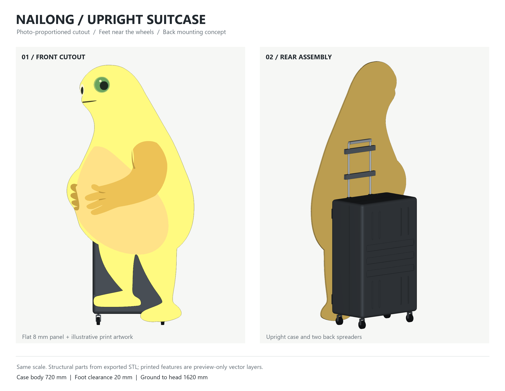

# 移动奶龙 / Mobile Nailong

产品目标是**爆改普通行李箱，实现平稳移动、手机遥控与自动跟随主人**；奶龙是可拆装的趣味外观。先完成低速遥控和跟随，再验证裸箱装物、手推与日常随行能力。当前交付处于方案/粗模阶段，尚无可运行实车。

**交给另一Agent审查：先读 [PRD 产品需求](docs/PRD.md) → [PDR 初步设计评审](docs/PDR.md) → [审查任务与证据入口](docs/REVIEW_HANDOFF.md)。** 本方案在 `codex/case26-shell-first` 分支与[草稿PR #1](https://github.com/Dalaoyuan2020/mobile-nailong/pull/1)，未合入前不要用旧main代表当前方案。

当前方案：**正常竖立的行李箱藏在奶龙立牌背后，双管拉杆贴板背，轮子在箱底。** 按参考照片近似描出圆头、鼓肚、抱腹双手和两只脚；立牌是一张 8 mm 平板，彩色图案为印刷示意。



## 当前交付

- [可整块复制的 prompt](docs/PROMPT_STAND_HANDLE.md)
- [装配 STEP](cad/standee/standee_assembly.step) / [STL](cad/standee/standee_assembly.stl) / [侧视](cad/standee/upright_side.png)
- [奶龙轮廓源码](cad/standee/nailong_profile.py) / [正面图案 SVG](cad/standee/front_artwork.svg) / [总装源码](cad/standee/standee.py)
- [材料与候选器件清单](docs/BOM.md) / [功能实现路线](docs/FUNCTIONS.md) / [可复现仿真](simulation/README.md)
- [交互仿真独立页](simulation/nailong-motion.html)：下载/克隆后用浏览器打开；GitHub文件页只展示源码。

默认板高 **1600 mm**，按照片比例宽约 **792 mm**，最低脚尖离地 **20 mm**，头顶离地 **1620 mm**；可用 `--height 1800` 改为 1800 mm 板、约 891 mm 宽、总高 1820 mm。轮廓和图案是参考照片的手工近似，尚非最终印刷稿。

箱壳沿用原 720×470×290 mm 两半壳，只旋转成高720、宽470、深290 mm的竖箱，箱底Z70、箱顶Z790。原 [case26 文件](cad/case26/) 保持原设计坐标，仅总装副本切嵌入式拉杆导座槽。拉杆双管Ø12、管距180，伸出箱顶350 mm。板背X145贴箱面与双管；背面两条概念压条中心Z920/1080，夹具、紧固件和承载能力留待实物验证，正面不画绑带。

当前 CAD 四个轮子是被动外形占位：Ø50、中心X±105/Y±200，左右距400、前后距210 mm。仿真的双电机差速驱动和候选80 mm轮尚未装进CAD；换轮须复核离地间隙、轮舱和接地点。旧540 mm轴距属于横放方案，不用于当前竖箱。

## 复现

```powershell
python -m pip install -r cad/standee/requirements.txt
python cad/handle/handle.py
python cad/standee/nailong_profile.py
python cad/standee/standee.py
python cad/standee/render_preview.py
```

导出过程检查有效实体、STEP回读、STL水密、零件干涉和贴合；印刷面不计入实体STEP。物理仿真使用假设质量与接地点，不能替代称重、实际制动和载荷试验。

## 历史方案

[箱壳初版 prompt](docs/PROMPT_CASE_FIRST.md)、[旧尺寸](docs/DIMENSIONS.md)、[旧计划](docs/PLAN.md)、[旧分层](docs/LAYERS.md)、[旧重心](docs/PHYSICS.md)、[旧电控](docs/ELECTRONICS.md)保留阶段记录。当前需求以[PRD](docs/PRD.md)、执行进度以[任务表](docs/TASKS.md)、外形以[竖箱奶龙 prompt](docs/PROMPT_STAND_HANDLE.md)为准；[资料摘录](docs/SOURCES.md)不作为本机性能证明。
