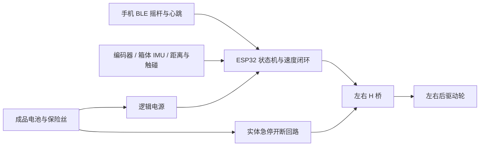

# 功能实现路线 · 先形状，再能稳稳地走

完整产品范围见[PRD](PRD.md)，可行性缺口见[PDR](PDR.md)。**手机遥控与自动跟随均为核心需求**：M1先验证稳定遥控，M2必须交付低速跟随，M3再验证裸箱日常使用；完成M1不能宣称整个产品完成。

当前交付是正常竖箱、贴箱奶龙切型板与背部固定占位的粗模；没有驱动底盘或已运行固件。板高默认 1600 mm，可调至 1800 mm，脚底 Z=20 mm，因此龙头离地约 1.62–1.82 m。它不从箱顶再叠高。固定方法未锁定，先验证背撑、两点分压夹持和下部承托。

## M1 · 稳定遥控工程样机

| 功能 | 实现方法 | 首版验收目标 |
|---|---|---|
| 手机遥控前进/停止 | 手机 BLE 控制界面 → ESP32 → 两路 H 桥 → 后两带编码器减速电机 | 放开摇杆停；最高 0.30 m/s；加速度不超过 0.25 m/s²；首版不开放倒车 |
| 缓慢转弯 | 后两固定驱动轮差速，前两万向；编码器闭环修正左右轮速 | 转弯半径不小于 1.5 m；禁原地自旋和左右轮反向甩尾 |
| 通信丢失停机 | 指令含序号/心跳；超时后目标速度归零，由健康且正常供电的控制器受控减速 | 台架初值 200 ms，实测通信延迟与停车距离后调整；恢复通信不自行起步 |
| 近障停车 | 三个前向传感器 + 低位触碰条进入统一停车状态 | 障碍消失后仍需人工重新使能；不自动后退 |
| 倾斜停车 | 箱体 IMU，融合倾角和角速度；阈值由重心/倾覆仿真与实物测试定 | 避开加速噪声误判；倾斜时停机锁定，不用“后退”补救 |
| 实体急停 | 常闭急停回路切断驱动电源；控制器独立低压供电记录状态 | 急停复位不自动启动；断电后的滑行距离单独实测 |

限速、阈值和停车逻辑是待实现的设计目标。0.30 m/s、减速度 0.25 m/s²、200 ms 延迟的理想停车距离为 `v×延迟 + v²/(2a) ≈ 0.24 m`，尚未包含传感器滤波、打滑、脚轮摆动和障碍余量；检测触发距离须大于实测停车距离再留余量。此数值依赖健康控制器受控减速，不能把断电等同于立即刹停，坡道保持需另外验证或增加机械驻车制动。[仿真假设与复现](../simulation/README.md) · [本轮计算结果](../simulation/results.json)

控制状态按“待机 → 人工使能 → 遥控 → 停车/故障”实现。速度闭环可从 100 Hz 台架起调，手机指令可从 20 Hz 起调；超时、过流、传感器异常与急停优先级高于摇杆。车体宽向轮距按 0.4 m 分配左右轮速；驱动设计以当前 210 mm 轴距为起点，不能把旧横箱 540 mm 轴距搬过来。ESP32 的 BLE、脉冲计数和电机 PWM 能支持这条实现路线。[Espressif 数据手册](https://documentation.espressif.com/esp32_datasheet_en.html)

奶龙脚部已接近地面，板又比箱体宽：前向测距头要通过板轮廓空隙、左右侧支架或单独透出口看到前方，不能沿用被 KT 板堵住的旧箱壳孔位。以 1600 mm 模型约 790 mm 最大板宽核对门框、转弯扫掠和行人间距；1800 mm 变体等比更宽。箱体 IMU 只反映箱体姿态，立牌晃动与夹持松动要另外做结构试验。

## 驱动底部怎么选

| 路径 | 好处 | 必须解决的事 | 当前建议 |
|---|---|---|---|
| 保持竖箱外形，后轮改差速驱动 | 接近用户参考照片，体积小 | 窄底座稳定性、轮座加强、电机容纳、板脚离地、坡道制动 | 先做可拆台架，用假负载验证后再回填 CAD |
| 成品遥控底盘承载竖箱 | 可减少传动制作 | 核对真实载荷、制动、限速接口；底盘会增宽/增高，必须重新排板脚与轮位 | 若前一路制造或成本不合适再比较，不先买 |

电机与电源的候选及约束见 [材料清单](BOM.md)。首轮仅在平整室内、有人看护的低速试验场景验证；越门槛、坡道、室外风载与人群穿行尚未具备依据。

## M2 · 自动跟随与奶龙登场（必交付）

跟随需要目标ID、距离、相对方向、时间戳和有效标志；先比较支持测角的UWB随身标签方案与相机/AprilTag方案，路线见[PDR定位评审](PDR.md)。手机负责启动、模式与停止，定位模块不直接驱动电机。允许随身标签是待评审假设，不能把普通手机BLE连接自动等同于精准定位。

先绑定目标并人工启动；跟随控制提出速度/转弯请求，与遥控共用限速、编码器闭环和全部停止条件。建议初始跟距1.8 m，定量验收按PRD A04–A05执行。目标信息超过200 ms未更新、身份不符或质量无效则进入停车；目标重新出现后不自动补跑。目标到车后或转弯无法满足半径限制时先停，不能原地甩尾。

奶龙登场先做按住触发的一次短动作，建议≤1 m且≤5 s，先到者结束；松手、接管、失联或障碍均能中止。跟随和登场不是同时输出速度的两个控制器，不做无人值守循环表演。

BLE RSSI只能反映受环境影响的信号强弱，单个RSSI不提供可靠方位。Bluetooth方向定位采用AoA/AoD与天线阵列，不能直接用普通RSSI代替。[Bluetooth Direction Finding](https://www.bluetooth.com/learn-about-bluetooth/feature-enhancements/direction-finding/)

## M3 · 实用裸箱与增强功能

1. **人工倒车**：补后向探测与倒车视场、制动验证后再开放；故障处理始终不自动后退。
2. **声音互动**：停车或手动按钮触发音效；ESP32 通过 UART 控制 DFPlayer，设置冷却时间避免连续播放。先不让声音检测直接驱动车辆。[DFPlayer 官方资料](https://www.dfrobot.com/product-1121.html)
3. **实用裸箱**：开盖、载物、断电手推、续航与日常跟随分别验收；PRD提出的0.8 m/s目标必须重新评审传动与制动。当前0.3 m/s奶龙模式不直接放宽限速，也不替代日常随行验收。

## 验证顺序

1. **外形与静态结构**：确认奶龙切型、1.6/1.8 m 两档、板贴箱、脚轮不蹭；称各件质量，定位重心，确认下部承托和上部夹持能分担载荷。
2. **参数仿真**：比较高度、配重、轮径和板前偏；核对倾覆余量、平地/坡面扭矩、速度与理想停车距离。仿真结果不替代 KT 挠曲、真实脚轮接触或风洞/路测。
3. **台架与空车**：先架空验证旋向、编码器、限流、急停、断连与复位，再用等质量假负载低速跑直线和大半径转弯，记录电流、温升和制动距离。
4. **定位与跟随**：固定场地采集目标误差/延迟/遮挡日志；用假负载完成跟随、失效停车和遥控接管，再装板复验。
5. **装板与实用裸箱**：装板从0.10 m/s逐级提高，检查晃动、松动、板材压痕、脚尖和探头遮挡；再做受控登场。裸箱速度、装物、开盖、手推与续航另按PRD验收，音效可后续添加。
