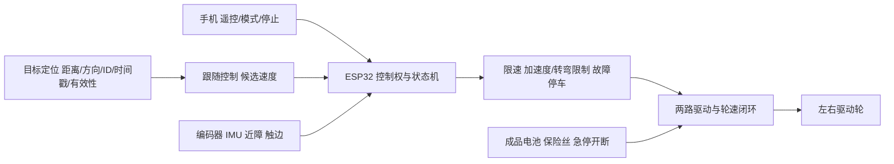

# PDR · 智能改装行李箱初步设计评审

版本0.1 · 2026-09-30 · **待评审，未通过制造/采购放行。** 对应需求：[PRD v0.1](PRD.md)。这里的PDR是Preliminary Design Review，负责判断方案、证据和缺口。

## 1. 当前结论与证据

| 项目 | 已有证据 | 尚不能推导的结论 |
|---|---|---|
| 外形 | 竖箱、奶龙切型板、拉杆、背面压条的STEP/STL与预览；默认16个有效实体，几何检查无实体穿插 | 不代表夹具抗拔、壳体强度、拉杆寿命或真实可制造性合格 |
| 稳定与运动 | [脚本与说明](../simulation/README.md)，24项计算断言，1.6/1.7/1.8 m对照 | 不包含真实轮胎附着、脚轮摆动、板弯曲、阵风及结构动态响应 |
| 交互估算 | [可浏览的仿真页](../simulation/nailong-motion.html)，可调板高/配重/速度/转弯/风 | 页面不连接实车；左侧为示意轨迹，不是自动跟随算法 |
| 控制与定位 | [功能路线](FUNCTIONS.md)及候选[BOM](BOM.md) | 目前没有电机装配、手机应用、控制固件或自动跟随实现 |

因此，本轮可以进入方案审查和实物测量；现有证据不能作为整车采购定型或M1–M3完成证明。

## 2. 机械路线

继续使用正常竖立行李箱，后两固定驱动轮+前两从动万向轮是待验证路线。箱身高720×宽470×深290 mm；当前轮中心X±105/Y±200 mm，左右距400、前后距210。原壳体保留历史540 mm孔距，不能把该孔距当作当前支持范围。

奶龙为8 mm切型平板，默认1600高/792宽、脚底Z20；拉杆露出350，双管距180，背面两条压条中心Z920/1080。压条仍是概念模型：还需要下部承托、KT分压/背撑、管夹锁止、箱内背板与载荷路径。板重量不能只靠薄壳或小胶点承受。

实用形态要求箱盖能打开、载物区可用、断电可手推。低位配重、驱动和电池会争用空间并增加搬运负担；当前6 kg只是仿真起点，应先称重与优化布局，再决定是否需要。装/拆奶龙后必须分别识别质量与速度配置。

## 3. 电控与停止链

目标定位只提交带时间戳和有效标志的相对位置，不直接控制电机。手机遥控、跟随和登场只能有一个运动请求来源；停止、过流、倾斜、近障、失联和目标失效均可撤销使能。断电停止与健康控制器受控制动是不同工况，均须实测；恢复连接/目标或急停复位后仍保持待机。

驱动轮编码器闭环与故障处置留在车端，手机/定位进程崩溃不能留下最后一个非零速度。首轮200 ms有效期要求定位刷新与端到端延迟留出余量；信号质量下降时停车，不能用平滑滤波把旧数据伪装成新测量。

## 4. 自动跟随：必须验证距离和方向

| 路线 | 拟用方式 | 优点 | 需证实的条件 |
|---|---|---|---|
| UWB测距+测角，主人带标签 | 车端支持AoA/PDoA的接收配置，目标标签与手机分别负责定位和操作 | 目标身份明确，可先不做人物识别 | 天线/模块是否真的支持方位、遮挡/多径、前后歧义、更新率、成本与安装位置 |
| 摄像头+AprilTag随身标记 | 标定相机、已知尺寸标记，识别指定ID并估计相对位置；单独计算单元给ESP32发结果 | 标记与日志容易观察，适合跟随算法台架 | 标记朝向/遮挡/光照、有效视场、相机延迟；增加算力、电源、质量与布线 |
| 直接跟人物外观或手机定位 | 后续评估 | 使用时可少一个标签 | 身份切换、遮挡恢复、手机兼容性与本地处理成本；本轮不据此承诺可用 |

优先拿能够输出**目标ID、距离、方位、有效性和时间戳**的完整评估方案做台架，测完再选UWB或视觉。允许随身标签是当前评审假设；若产品要求只有手机，必须列出支持的具体设备与接口。单个BLE RSSI、单个仅测距UWB或超声“看到前面有人”不能直接满足目标跟随需求。

官方依据：[Qorvo QM33120WDK1](https://www.qorvo.com/products/ek/QM33120WDK1)明确区分AoA/非AoA子板与单双天线，可用于测距/测角评估；这不代表任意UWB板都有方位输出。[AprilTag官方](https://github.com/AprilRobotics/apriltag#pose-estimation)支持位姿估计，需要标记尺寸与相机内参。以上只是候选路线依据，尚未在本项目验证。

跟随算法建议先做：绑定目标 → 校验有效期 → 限定跟距误差/方位误差 → 生成前向速度与转弯请求 → 共用运动限幅与障碍停车。原地掉头或目标移到车后时先停并要求重定位，不强行甩尾追上。无绕障路径规划时，障碍挡路就停并提示用户。

## 5. 关键可行性缺口

| ID | 缺口 / 与PRD的关系 | 审查需要的证据 |
|---|---|---|
| D01 | 210 mm前后支持距、1.6–1.8 m大板与风载 / R01、R05 | 实物轮接地点/脚轮旋转包络、称重重心、静态/动态倾覆余量 |
| D02 | 低位20 mm脚尖和宽板会擦地/挡探头 / A06 | 带载挠曲、转弯扫掠、实际通道宽度与传感器全宽视场 |
| D03 | 拉杆、KT、夹具及薄壳载荷路径 / R05 | 下部承托、分压背板与锁止详图，载荷与振动试验；当前压条不可直接当制造图 |
| D04 | 日常跟随速度与当前传动不同 / A10 | 电机在所需转速的持续扭矩、温升、制动与附着试验，不能用堵转值选型 |
| D05 | 跟随定位路线未选 / R03、A04–A05 | 原始目标轨迹、误差/延迟分布、遮挡与混入目标测试、手机/标签兼容性 |
| D06 | 仍要当行李箱使用 / R07、A08 | 开箱/储物/提拉/断电手推实测；电池、配重和内骨架的布局 |
| D07 | 电池、电流、续航、总预算未定 / A09 | 带载电流与功率记录、成品电源选型、厂家报价；不直接沿用旧横箱预算 |

特别核对：PRD裸箱0.8 m/s是新提议，不是把现有限速滑杆调大即可。Ø50轮需要约306 rpm；当前BOM中200 rpm空载候选电机连该空载轮速也达不到。在当前0.25 m/s²减速度、0.2 s延迟假设下，0.8 m/s停距为1.44 m，已经接近1.5 m跟距下沿。必须重选传动、制动/跟距与速度配置，或调整产品指标；不能拿奶龙低速算例验收裸箱日常跟随。

已有1.6 m算例使用总重15.5 kg、低位配重6 kg，重心约302 mm，0.3 m/s断连受控停距0.24 m。1.8 m板按同面密度扩大后总重约15.898 kg，重心约327 mm。在5 m/s不利向风叠加加减速的假设筛查中，前后余量由约+15 mm变为−20 mm；这是模型对高度的敏感性证据，不是允许运行风速。

## 6. 评审后推进顺序

1. 实测现有箱、轮位、质量与开箱空间；确定固定与下部承托，更新真实几何参数。
2. 审定M1电机/轮座/加强件/电源候选；架空验证转向、编码器、限流、停止与复位，再做假负载遥控。
3. 在同一路线对跟随定位候选采集数据，明确是否接受标签，冻结M2的传感器与预算。
4. 接跟随控制与公共停止链；先假负载，再装奶龙；完成PRD的低速跟随与登场验收。
5. 单独评审裸箱0.8 m/s、载物、续航和手推；必要时修订传动及速度目标，再完成M3。

评审结论使用“通过 / 有条件通过 / 需修改”，逐项列证据、影响的需求ID、整改动作与复验方式。几何通过不代表结构通过，低速遥控通过也不代表自动跟随或日常行李箱功能通过。
